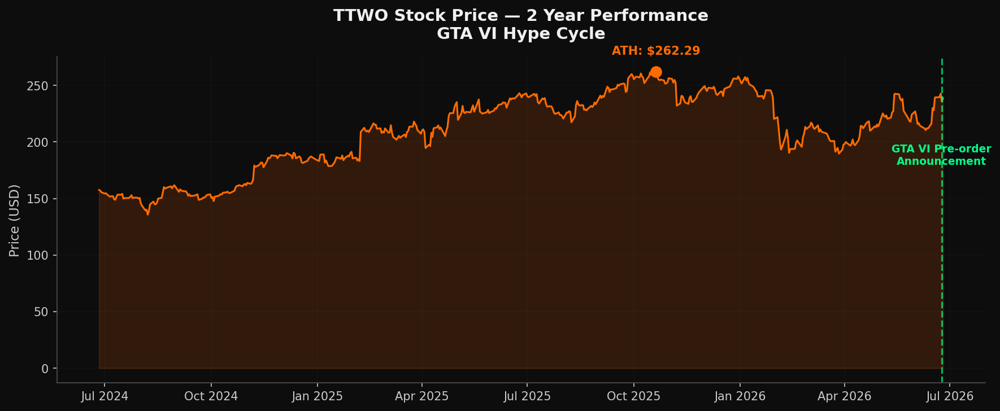

# VICE CAPITAL — The GTA VI Capitalist Command Center

> Treat the game as a market, not a toy.

A single-page web app for anyone who wants to **capitalize on — and have fun with** — the
biggest entertainment launch in history: **Grand Theft Auto VI**, releasing November 19, 2026.
It turns a research dossier on the GTA VI opportunity into an interactive command center covering
the stock-market angle, the in-game economy, the content-creator playbook, and real-world arbitrage.

It's built to be enjoyed, and it's honest about what it is: an **informational and entertainment
project**, not financial advice. Numbers are a snapshot as of June 26, 2026.



## What's inside

- **Live launch countdown** to November 19, 2026, plus a rolling "virtual economy" ticker.
- **The thesis dashboard** — why this is a generational event, with animated stat counters and a
  revenue comparison against the biggest movies ever made.
- **Six Regions, One Economy** — an interactive map of Leonida (Vice City, Leonida Keys, Grassrivers,
  Port Gellhorn, Hamlet, Kelly County). Tap a region to read its economic profile, the capitalist
  angle, where the money is, and an entry-cost meter.
- **Stock Intelligence** — TTWO analyst targets, peripheral plays (SONY, MSFT, NVDA, CRSR, EA), a
  hype-cycle chart, and a "sell the news" reality check.
- **The Economic Engine** — strategy cards, a **Mission ROI calculator** (price your time), and a
  **property investment matrix** with computed payback periods.
- **Build Your Content Empire** — content lanes, a **revenue estimator**, and a platform comparison
  matrix (YouTube / TikTok / Twitch / X).
- **Real-World Arbitrage** — affiliate programs, service arbitrage, and digital products, with honest
  risk labels (including ToS/ban-risk flags on gray-market plays).
- **The Capitalist Toolkit** — downloadable-style templates and Day 1 / Week 1 / Month 1 checklists.
- **Timeline & Risk Radar** — every market-moving catalyst mapped, with probabilities and hedges.
- **Craft details** — a living aurora/grid backdrop, scroll-reveal motion, a scroll-progress bar,
  a cash-burst easter egg ("Make It Rain"), toasts, active-section nav, and full reduced-motion support.

## Tech stack

- **React 19** + **TypeScript** + **Vite 7**
- **Tailwind CSS 3** with a shadcn/ui component library (Radix primitives)
- **lucide-react** icons, **sonner** toasts, **recharts** available
- **Self-hosted fonts** (Inter + JetBrains Mono via `@fontsource`) — no external CDN, works offline
  and on locked-down networks

## Getting started

```bash
npm install
npm run dev      # http://localhost:3000
```

Build and preview the production bundle:

```bash
npm run build    # type-checks then builds to dist/
npm run preview
```

The build is fully self-contained (all fonts and assets are bundled), so `dist/` can be deployed to
any static host — Vercel, Netlify, GitHub Pages, Cloudflare Pages, or an S3 bucket. `vite.config.ts`
uses `base: './'` so it also works from a sub-path.

## Project structure

```
src/
  App.tsx           All sections + shared motion/count-up primitives
  main.tsx          Entry point (mounts App, imports fonts)
  index.css         Design tokens, glass/utility classes, backdrop + motion CSS
  components/ui/     shadcn/ui component library
public/             Section background imagery
docs/
  GTA-VI-INTELLIGENCE-DOSSIER.md   The full research report behind the app
  research/                        Source market data (CSV) + reference chart
```

## Disclaimer

Not financial advice. For informational and entertainment purposes only. Market data is a snapshot as
of June 26, 2026. Any gray-market "service arbitrage" ideas are described for completeness and carry
the risk labels shown in the app; they may violate a game's Terms of Service — you're responsible for
your own choices. GTA and Grand Theft Auto are trademarks of their respective owners; this is an
unofficial fan project with no affiliation.
